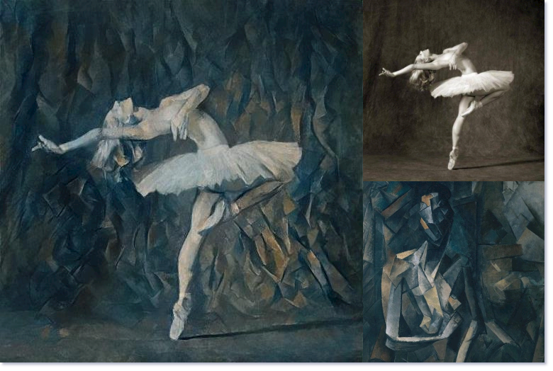
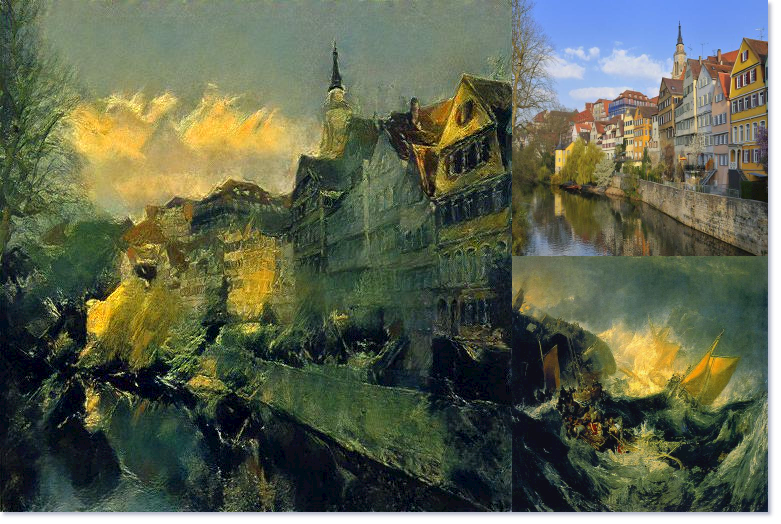
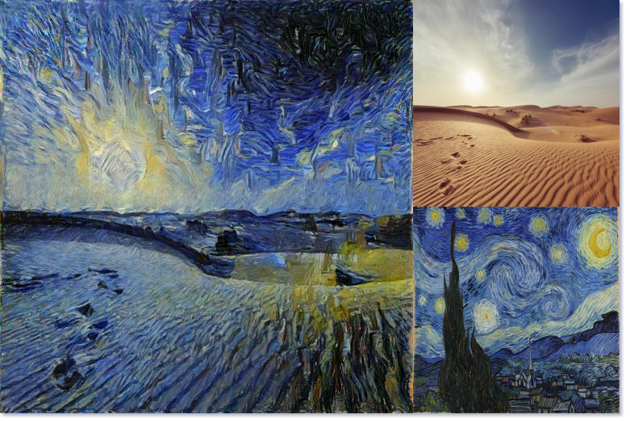

---

<div align="center">    
 
# Neural Style Transfer with PyTorch

</div>
 
## Description   
Pytorch implementation of the Neural Style Transfer algorithm. Link to the original paper: [Gatys et al.](./paper/neural_style_transfer.pdf)

## How to run   
First, install dependencies (a new python virtual environment is recommended).   
```bash
# clone project   
git clone https://github.com/visualCalculus/neural-style-transfer

# install project   
cd neural-style-transfer
pip install -e .
pip install -r requirements.txt
 ```   
 Next, navigate to src folder and run train.py with appropriate content and style image paths.  
 ```bash
# module folder
cd nst

CONTENT_DIR={path to content image}
STYLE_DIR={path to style image}
OUTPUT_DIR={path to save result image}

# run module
python train.py --use_gpu=true --content_dir=${CONTENT_DIR} \
--style_dir=${STYLE_DIR} --input_image="content" \
--output_dir=${OUTPUT_DIR} --iterations=100 \ 
--alpha=1 --beta=1000000 \ 
--style_layer_weight=1.0

```

## Results
<div align="center">





</div>

### Citation   
```
@misc{visualCalculus2021nst,
  title={neural-style-transfer},
  author={Tejomay, Abhiroop},
  publisher={GitHub}
  journal={GitHub repository},
  year={2021},
  howpublished={\url{https://github.com/visualCalculus/neural-style-transfer}}
}
```   
